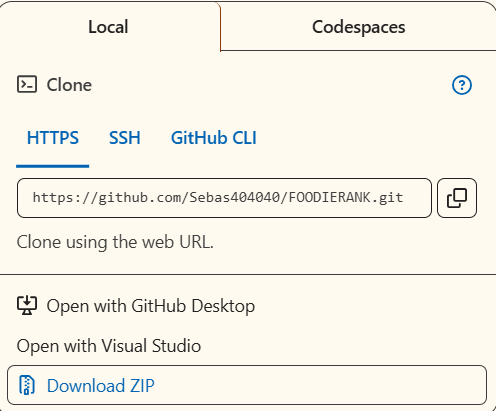
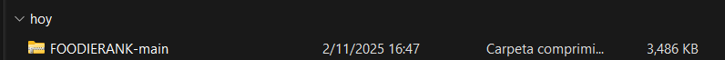
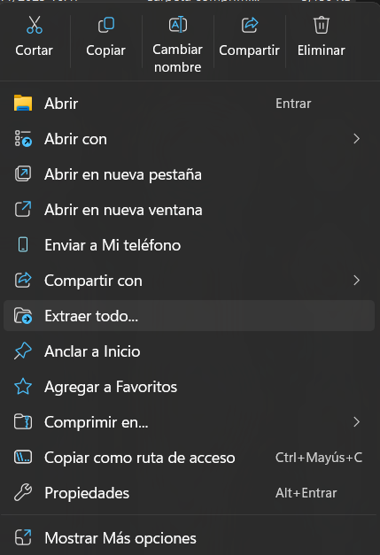
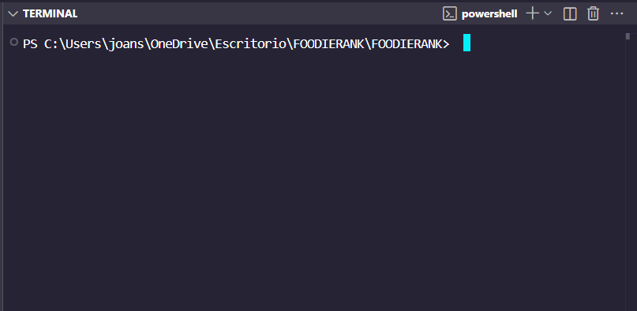
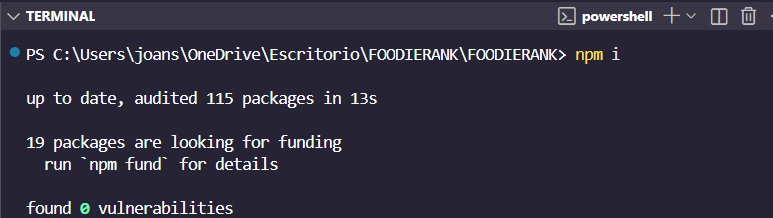
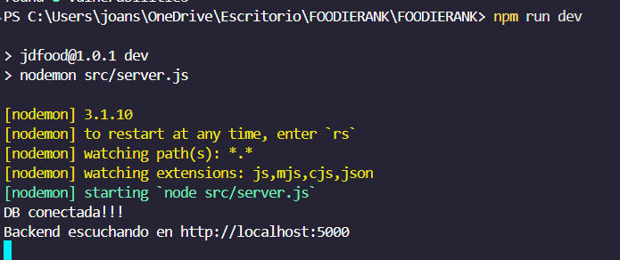

# ⭐ FOODIERANK 🍝


FoodieRank es una aplicación web diseñada para ser el punto de encuentro definitivo entre los amantes de la gastronomía y los mejores establecimientos de comida. Su propósito fundamental es ofrecer transparencia y una clasificación impulsada por la comunidad para ayudar a los usuarios a tomar decisiones informadas sobre dónde comer.

En este repositorio encontrará la documentación previa acerca de las secciones más importantes para la funcionalidad correcta del backend.

## Estructura del backend 🧱

```bash
FOODIERANK/
├── src/
│   ├── config/
│   │   ├── db.js                   # Configuración de la conexión a MongoDB.
│   │   ├── passport.js             # Configuración de JWT Passport para autenticación.
│   │   └── ...
│   ├── controllers/                # Lógica de manejo de peticiones (req/res).
│   │   ├── authentication.controller.js
│   │   ├── categorias_platos.controller.js
│   │   ├── categorias_restaurantes.controller.js
│   │   ├── platos.controller.js
│   │   ├── ranking_avg.controller.js
│   │   ├── resenas_platos.controller.js
│   │   ├── resenas_restaurantes.controller.js
│   │   └── usuarios.controller.js
│   ├── DTOS/                       # Data Transfer Objects (Esquemas de validación con express-validator).
│   │   ├── authenticationDTO.js
│   │   ├── categoria_platoDTO.js
│   │   ├── categoria_RestauranteDTO.js
│   │   ├── platoDTO.js
│   │   ├── reseña_platoDTO.js
│   │   ├── reseña_RestauranteDTO.js
│   │   └── usuarioDTO.js
│   ├── middelewares/               # Funciones intermedias (Middleware).
│   │   ├── authenticationMiddleware.js # Verifica el token JWT.
│   │   └── validationDTO.js        # Aplica validación de DTOs.
│   ├── routers/                    # Define las rutas de la API y asigna controladores.
│   │   ├── authentication.routes.js
│   │   ├── categorias_platos.routes.js
│   │   ├── categorias_restaurantes.routes.js
│   │   ├── platos.routes.js
│   │   ├── ranking_avg.routes.js
│   │   ├── resenas_platos.routes.js
│   │   ├── resenas_restaurantes.routes.js
│   │   └── usuarios.routes.js
│   ├── services/                   # Lógica de negocio e interacción directa con la DB.
│   │   ├── authentication.services.js
│   │   ├── categorias_platos.services.js
│   │   ├── categorias_restaurantes.services.js
│   │   ├── platos.services.js
│   │   ├── ranking_avg.js          # Lógica para cálculo de promedios.
│   │   ├── resenas_platos.services.js
│   │   ├── resenas_restaurantes.services.js
│   │   └── usuarios.services.js
│   ├── server.js                   # Archivo principal de Express (Configuración de middlewares y rutas).
│   ├── seed.js                     # Script para poblar la base de datos con datos iniciales.
│   ├── swagger.spec.js             # Definición de la documentación Swagger/OpenAPI.
│   └── validationSchemas.js        # Esquemas de validación de MongoDB.
├── package.json
└── README.md

```


## Instrucciones de instalación 🆙

En esta  seeción se encuentran las instrucciones de instalación para el backend de FOODIERANK.

1. Entrar al link de este repositorio oficial para descargar el backend:

https://github.com/Sebas404040/FOODIERANK

2. Descargar la carpeta con el BACKEND:




3. Al haber descargado el archivo .zip se debe descomprimir 



4. Descomprimir el archivo



5. Al haber descomprimido el archivo se abre una terminal con la ruta de la carpeta del backend




6. Se ejecuta el comando `npm install` para instalar las dependencias necesarias.



7. Se ejecuta el comando `npm run dev` para iniciar el servidor.



## Planeación ☁️

En esta sección se encuentran los modelos de bases de datos para la creación correcta de la base de datos y la estructuraci;ón de las entidades. Secci;ón muy importante ya que senta las bases del aplicativo web. 

### Modelo E-R 🟦 - 🟥


En este primer diagrama se detallan los atributos y entidades primarias con graficos de menor grado.

### Modelo lógico 🔳


En este diagrama un poco mas denominado se detallan los tipos de datos y clasificaciones mas esquematizadas.

### Modelo fisico

Al utilizar una base de datos noSQL (MongoDB) se presenta el siguiente modelo fisico por esquemas de validaciones.

#### Usuarios

```javascript
db.createCollection('usuarios', {
  validator: {
    $jsonSchema: {
      bsonType: 'object',
      required: [
        'id',
        'username',
        'password',
        'role',
        'correo'
      ],
      properties: {
        id: {
          bsonType: 'int',
          description: 'Identificador único del usuario.'
        },
        username: {
          bsonType: 'string',
          description: 'Nombre de usuario único.'
        },
        password: {
          bsonType: 'string',
          description: 'Contraseña hasheada.'
        },
        role: {
          bsonType: 'string',
          'enum': [
            'admin',
            'user'
          ],
          description: 'Define el rol del usuario.'
        },
        correo: {
          bsonType: 'string',
          description: 'Correo electrónico del usuario.'
        },
        telefono: {
          bsonType: 'string',
          description: 'Número de teléfono opcional.'
        }
      }
    }
  }
})
```

Esta colección almacena la información de los usuarios registrados en la aplicación. Cada documento representa un usuario con sus credenciales de acceso, rol y datos de contacto. El esquema incluye validaciones para asegurar que los campos requeridos estén presentes y que el rol sea válido.

#### Restaurantes

```javascript
db.createCollection('restaurantes', {
  validator: {
    $jsonSchema: {
      bsonType: 'object',
      required: [
        'id',
        'categoriaId',
        'nombre',
        'direccion',
        'descripcion'
      ],
      properties: {
        id: {
          bsonType: 'int',
          description: 'Identificador único del restaurante.'
        },
        nombre: {
          bsonType: 'string',
          description: 'Nombre del restaurante.'
        },
        categoriaId: {
          bsonType: 'int',
          description: 'Referencia a categorias_restaurantes.'
        },
        direccion: {
          bsonType: 'string',
          description: 'Dirección física del restaurante.'
        },
        imagen_url: {
          bsonType: 'string',
          description: 'URL de la imagen del restaurante.'
        },
        descripcion: {
          bsonType: 'string',
          description: 'Descripción detallada del restaurante.'
        }
      }
    }
  }
})
```

Esta colección almacena la información de los restaurantes registrados en la plataforma. Cada documento contiene los detalles básicos de un restaurante, incluyendo su ubicación, categoría y descripción. El esquema asegura que toda la información esencial esté presente para cada restaurante.

#### Platos

```javascript
db.createCollection('platos', {
  validator: {
    $jsonSchema: {
      bsonType: 'object',
      required: [
        'id',
        'id_restaurante',
        'nombre',
        'precio',
        'categoriaId'
      ],
      properties: {
        id: {
          bsonType: 'int',
          description: 'Identificador único del plato.'
        },
        nombre: {
          bsonType: 'string',
          description: 'Nombre del plato.'
        },
        categoriaId: {
          bsonType: 'int',
          description: 'Referencia a categorias_platos.'
        },
        descripcion: {
          bsonType: 'string',
          description: 'Descripción detallada del plato.'
        },
        precio: {
          bsonType: 'double',
          description: 'Precio del plato.'
        },
        imagen_url: {
          bsonType: 'string',
          description: 'URL de la imagen del plato.'
        },
        id_restaurante: {
          bsonType: 'int',
          description: 'Referencia al restaurante al que pertenece el plato.'
        }
      }
    }
  }
})
```

Esta colección almacena la información de los platos disponibles en los restaurantes. Cada documento representa un plato con sus detalles, incluyendo precio, categoría y el restaurante al que pertenece. El esquema garantiza que toda la información necesaria esté presente para cada plato.

#### Resenas_restaurantes

```javascript
db.createCollection("resenas_restaurantes", {
  validator: {
    $jsonSchema: {
      bsonType: 'object',
      required: [
        'id',
        'usuarioId',
        'restauranteId',
        'calificacion',
        'comentario',
        'fecha',
        'likes'
      ],
      properties: {
        id: {
          bsonType: 'int',
          description: 'Identificador único de la reseña.'
        },
        restauranteId: {
          bsonType: 'int',
          description: 'Referencia al restaurante reseñado.'
        },
        usuarioId: {
          bsonType: 'int',
          description: 'Referencia al usuario que hizo la reseña.'
        },
        calificacion: {
          bsonType: 'int',
          minimum: 1,
          maximum: 5,
          description: 'Calificación del restaurante (1-5 estrellas).'
        },
        comentario: {
          bsonType: 'string',
          description: 'Comentario de la reseña.'
        },
        fecha: {
          bsonType: 'date',
          description: 'Fecha de la reseña.'
        },
        likes: {
          bsonType: 'int',
          minimum: 0,
          description: 'Número de likes de la reseña.'
        }
      }
    }
  }
})
```

Esta colección almacena las reseñas realizadas por los usuarios a los restaurantes. Cada documento incluye la calificación, comentarios y métricas de interacción social. El esquema valida que las calificaciones estén entre 1 y 5, y que los likes no sean negativos.

#### Resenas_platos

```javascript
db.createCollection("resenas_platos", {
  validator: {
    $jsonSchema: {
      bsonType: 'object',
      required: [
        'id',
        'usuarioId',
        'platoId',
        'calificacion',
        'comentario',
        'fecha',
        'likes'
      ],
      properties: {
        id: {
          bsonType: 'int',
          description: 'Identificador único de la reseña.'
        },
        platoId: {
          bsonType: 'int',
          description: 'Referencia al plato reseñado.'
        },
        usuarioId: {
          bsonType: 'int',
          description: 'Referencia al usuario que hizo la reseña.'
        },
        calificacion: {
          bsonType: 'int',
          minimum: 1,
          maximum: 5,
          description: 'Calificación del plato (1-5 estrellas).'
        },
        comentario: {
          bsonType: 'string',
          description: 'Comentario de la reseña del plato.'
        },
        fecha: {
          bsonType: 'date',
          description: 'Fecha de la reseña.'
        },
        likes: {
          bsonType: 'int',
          minimum: 0,
          description: 'Número de likes de la reseña.'
        }
      }
    }
  }
})
```

Esta colección almacena las reseñas realizadas por los usuarios a los platos específicos. Cada documento incluye la calificación, comentarios y métricas de interacción social. El esquema valida que las calificaciones estén entre 1 y 5, y que los likes no sean negativos.

#### Categorias_restaurantes

```javascript
db.createCollection('categorias_restaurantes', {
  validator: {
    $jsonSchema: {
      bsonType: 'object',
      required: [
        'id',
        'nombre'
      ],
      properties: {
        id: {
          bsonType: 'int',
          description: 'Identificador único de la categoría.'
        },
        nombre: {
          bsonType: 'string',
          description: 'Nombre de la categoría de restaurantes.'
        }
      }
    }
  }
})
```

Esta colección almacena las diferentes categorías a las que pueden pertenecer los restaurantes (por ejemplo: italiana, mexicana, asiática, etc.). Cada documento representa una categoría única con su identificador y nombre.

#### Categorias_platos

```javascript
db.createCollection('categorias_platos', {
  validator: {
    $jsonSchema: {
      bsonType: 'object',
      required: [
        'id',
        'nombre'
      ],
      properties: {
        id: {
          bsonType: 'int',
          description: 'Identificador único de la categoría.'
        },
        nombre: {
          bsonType: 'string',
          description: 'Nombre de la categoría de platos.'
        }
      }
    }
  }
})
```

Esta colección almacena las diferentes categorías a las que pueden pertenecer los platos (por ejemplo: entradas, platos principales, postres, bebidas, etc.). Cada documento representa una categoría única con su identificador y nombre.


## Endpoints importantes 🔗

Esta sección detalla los servicios de la API REST, accesible en la base **`http://localhost:5000`**, organizados por su funcionalidad principal.

### Módulo I: Autenticación y Perfil de Usuario (`/auth` & `/usuarios`)
Gestión de acceso y perfiles de usuario en la plataforma.

#### Autenticación
* **Registro de Nuevo Usuario**
  * `POST /auth/register`
  * **Propósito:** Permite la creación de una cuenta con rol `user` o `admin`.
  * **Ejemplo de Petición (Body):**
    ```json
    {
      "username": "test_user",
      "password": "password123",
      "role": "user",
      "correo": "test@example.com",
      "telefono": "1234567890"
    }
    ```
  * **Resultado (201 Creado):** Devuelve el perfil básico del usuario y establece el token JWT en una cookie HttpOnly.

* **Inicio de Sesión**
  * `POST /auth/login`
  * **Propósito:** Autentica al usuario, devolviendo datos de sesión, incluido el `numericId` para referencias en reseñas.
  * **Ejemplo de Petición (Body):**
    ```json
    {
      "correo": "test@example.com",
      "password": "password123"
    }
    ```
  * **Resultado (200 OK):** Incluye el `numericId` y el `role` del usuario.

#### Consulta de Usuarios
* **Obtener Todos los Usuarios**
  * `GET /usuarios`
  * **Propósito:** Listado completo de todos los usuarios registrados.

* **Obtener Usuario por ID Numérico**
  * `GET /usuarios/:id`
  * **Propósito:** Consulta los datos de un usuario específico utilizando su ID numérico.

---

### Módulo II: Restaurantes y Platos (`/restaurantes` & `/platos`)
Gestión de la información base de la oferta gastronómica.

#### Gestión de Restaurantes
* **Listar Restaurantes**
  * `GET /restaurantes`
  * **Propósito:** Devuelve la lista completa de todos los restaurantes activos.

* **Crear Restaurante**
  * `POST /restaurantes` (Requiere Autenticación)
  * **Ejemplo de Petición (Body):**
    ```json
    {
      "nombre": "Nuevo Lugar",
      "categoriaId": 4,
      "direccion": "...",
      "imagen_url": "...",
      "descripcion": "..."
    }
    ```
* **Actualizar Restaurante**
  * `PATCH /restaurantes/:id` (Actualización Parcial - Requiere Auth)
  * **Propósito:** Modifica campos específicos del restaurante.

* **Eliminar Restaurante**
  * `DELETE /restaurantes/:id` (Eliminación - Requiere Auth)
  * **Propósito:** Elimina un restaurante del catálogo.

#### Gestión de Platos
* **Listar Platos**
  * `GET /platos`
  * **Propósito:** Devuelve la lista completa de todos los platos.

* **Crear Plato**
  * `POST /platos` (Requiere Autenticación)
  * **Ejemplo de Petición (Body):**
    ```json
    {
      "nombre": "Postre de Día",
      "categoriaId": 3,
      "descripcion": "...",
      "precio": 5.00,
      "id_restaurante": 1,
      "imagen_url": "..."
    }
    ```
* **Actualizar Plato**
  * `PATCH /platos/:id` (Actualización Parcial - Requiere Auth)
  * **Propósito:** Modifica campos específicos del plato.

* **Eliminar Plato**
  * `DELETE /platos/:id`
  * **Propósito:** Elimina un plato del menú.

---

### Módulo III: Interacción y Reseñas (`/resenas_restaurantes` & `/resenas_platos`)
Manejo del contenido generado por los usuarios (UGC).

#### Reseñas de Restaurantes
* **Crear Nueva Reseña**
  * `POST /resenas_restaurantes`
  * **Propósito:** Permite a un usuario enviar una calificación y comentario.
  * **Ejemplo de Petición (Body):**
    ```json
    {
      "restauranteId": 1,
      "usuarioId": 6, 
      "calificacion": 5,
      "comentario": "Genial",
      "fecha": "2025-11-02", 
      "likes": 0
    }
    ```
* **Obtener Reseñas por Restaurante**
  * `GET /resenas_restaurantes/:id`
  * **Propósito:** Devuelve todas las reseñas asociadas al ID del restaurante.

* **Dar/Quitar Like**
  * `PATCH /resenas_restaurantes/like/:id`
  * **Propósito:** Permite a un usuario interactuar con la reseña de otro.
  * **Petición (Body):** `{"id_usuario": 6}`

* **Editar Reseña**
  * `PATCH /resenas_restaurantes/:id`
  * **Propósito:** Modifica la calificación y/o el comentario de la reseña.

#### Reseñas de Platos
* **Crear Nueva Reseña de Plato**
  * `POST /resenas_platos`
  * **Propósito:** Permite calificar un plato específico.
  * **Petición (Body):** (Similar al de restaurantes, usando `platoId`).

* **Obtener Reseñas por Plato**
  * `GET /resenas_platos/:id`
  * **Propósito:** Devuelve todas las reseñas asociadas al ID del plato.

* **Editar Reseña de Plato**
  * `PATCH /resenas_platos/:id`
  * **Propósito:** Modifica la calificación y/o el comentario de la reseña.

* **Dar/Quitar Like a Plato**
  * `PATCH /resenas_platos/like/:id`
  * **Petición (Body):** `{"id_usuario": 6}`

---

### Módulo IV: Categorías y Rankings (`/categorias_*` & `/ranking`)
Estructura de datos y métricas de desempeño.

#### Gestión de Categorías (Requiere Autenticación)
* **Crear Categoría (Restaurantes/Platos)**
  * `POST /categorias_restaurantes` | `POST /categorias_platos`
  * **Ejemplo:** `{"nombre": "Comida Tailandesa"}`

* **Listar Categorías**
  * `GET /categorias_restaurantes` | `GET /categorias_platos`
  * **Propósito:** Obtiene todas las categorías disponibles.

* **Asignar Categoría a un Item**
  * `PATCH /categorias_restaurantes/:id_cat` (Asigna categoría a un **restaurante** - Body: `{"id_restaurante": 5}`)
  * `PATCH /categorias_platos/:id_cat` (Asigna categoría a un **plato** - Body: `{"id_plato": 12}`)

#### Cálculo de Rankings
* **Ranking de Restaurante**
  * `GET /ranking/restaurantes/:id`
  * **Propósito:** Devuelve el promedio de calificación para el restaurante.
  * **Resultado (200 OK):** `4.25`

* **Ranking de Platos**
  * `GET /ranking/platos/:id`
  * **Propósito:** Devuelve el promedio de calificación para el plato.
  * **Resultado (200 OK):** `3.8`

## Principios aplicados 🧰

Los principios aplicados fueron los siguientes

### Principio de responsabilidad única 1️⃣

Este principio establece que un módulo debe tener solo una razón para cambiar. El código lo aplica de manera fuerte mediante una arquitectura de capas bien definida:

- **Routers (*.routes.js):** Se encargan únicamente de definir las rutas y orquestar la secuencia de middlewares y controllers.

- **Controllers (*.controller.js):** Su única responsabilidad es manejar la lógica de la capa HTTP, es decir, procesar la solicitud (req), invocar al servicio y enviar la respuesta con el código de estado apropiado (res.status(200).json(...)).

- **Services (*.services.js):** Contienen la lógica de negocio y la interacción con la base de datos (persistencia), por ejemplo, obtenerRestaurantes o crearPlato.

- **DTOs (*.DTO.js):** Se enfocan únicamente en la validación de los datos de entrada para cada entidad (ej. createPlatoDTO en platoDTO.js).

### Principio de abierto/cerrado 2️⃣

(Open/Closed Principle)

El código está abierto a extensión, pero cerrado a modificación en componentes centrales:

- **Lógica de Negocio/Validación:** Para cambiar la validación de una ruta, se extiende el array de validadores en el DTO (ej. restauranteDTO.js) y se añade a la ruta, sin necesidad de modificar el código del controller ni del middleware de validación genérico (validationDTO.js).

- **Adición de Funcionalidad:** La adición de nuevas funcionalidades, como las rutas de ranking, se maneja creando nuevos módulos de enrutamiento (ranking_avg.routes.js) y agregándolos a server.js con app.use().

### Principio de abierto/cerrado 4️⃣

(Interface Segregation Principle)

- **Módulos de Servicio Pequeños:** Los servicios se dividen en módulos muy específicos (las "interfaces"), como ranking_avg.js (solo para el cálculo de promedios), resenas_platos.services.js (solo para reseñas de platos), etc.

- **Clientes Esbeltos:** Los controllers solo importan el módulo de servicio exacto que necesitan, asegurando que no dependan de funcionalidades que no utilicen (ej. restaurantes.controller.js solo importa restaurantes.services.js).

## Trabajo Colaborativo y Gestión de Proyecto 📊

### Herramientas de Gestión

Para la gestión y seguimiento del desarrollo del backend, utilizamos ClickUp como nuestra herramienta principal de gestión de proyectos.
### 🎯 Nuestro Espacio de Colaboración

<div align="center">

<table align="center">
<tr>
<td align="center">
<h2>🔄 Gestión Ágil con ClickUp 🚀</h2>

[](https://sharing.clickup.com/90132667950/b/h/6-901321762897-2/cf7625048836b0b)

</td>
</tr>
<tr>
<td align="center">

| 📊 Métricas | 📝 Documentación | 🤝 Colaboración | ⚡ Eficiencia |
|:-----------:|:----------------:|:---------------:|:-------------:|
| Metricas de progreso | Swagger de API | Chat en equipo | Automatización |

</td>
</tr>
</table>

<h3>💫 Únete a la Experiencia FoodieRank</h3>

[](https://sharing.clickup.com/90132667950/b/h/6-901321762897-2/cf7625048836b0b)

</div>

## videos 📷

https://drive.google.com/drive/folders/1OV5cuRo293_W1R4XjBPh9j6BTwkmZlPp?usp=sharing

### Metodología de Trabajo

Seguimos una metodología ágil basada en:

- **Sprints de 2 semanas**
- **Daily meetings** para seguimiento
- **Code reviews** obligatorios
- **Integración continua** con pruebas automatizadas
- **Documentación incremental**

## Conclusión ✅

La culminación del desarrollo del backend de FoodieRank establece una base robusta, segura y escalable para la aplicación. Mediante la adopción de tecnologías modernas y una arquitectura modular, se ha logrado construir la base de dato, arquitecturas de API y lógica que soporta todas las funcionalidades de la plataforma.

## Autores 🥷 🥷

- Davisson Adriel Román (Product Owner, Developer)

- Joan Sebastián Gómez Serrano (SCRUM Masterm, developer)